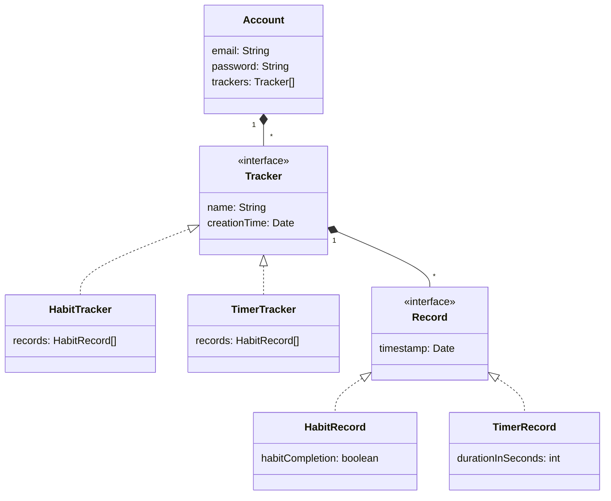

```mermaid
classDiagram

    class Account {
        email: String
        password: String
        trackers: Tracker[]
    }

    class HabitTracker{
        records: HabitRecord[]
    }

    class TimerTracker{
        records: HabitRecord[]
    }

    class Tracker {
        <<interface>>
        name: String
        creationTime: Date
    }
    class Record{
        <<interface>>
        timestamp: Date
    }

    class HabitRecord{
        habitCompletion: boolean
    }

    class TimerRecord{
        durationInSeconds: int
    }


    Tracker <|.. HabitTracker
    Tracker <|.. TimerTracker

    Record <|.. HabitRecord
    Record <|.. TimerRecord

    Account "1" *-- "*" Tracker
    Tracker "1" *-- "*" Record
```
